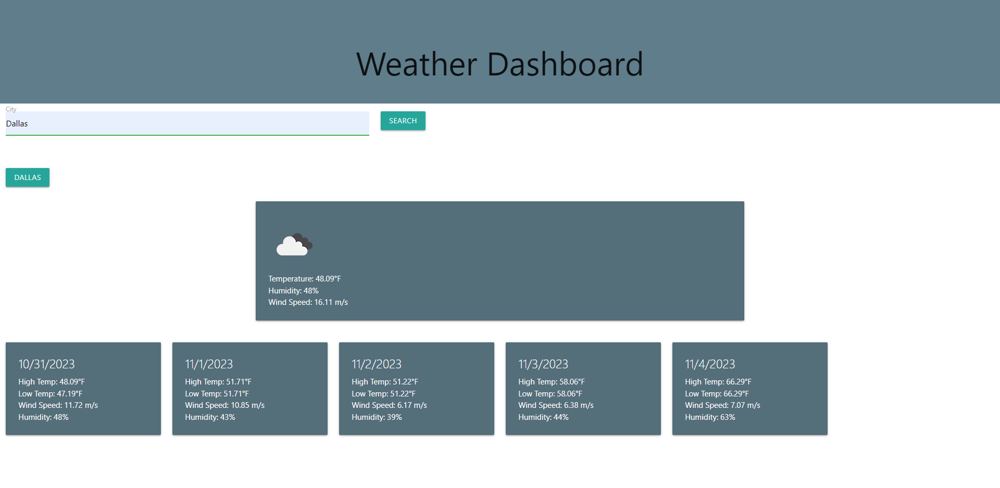

# Weather App

## Description

This repo contains the content for week 6

- I wanted to create a tool that can be used to check the current weather in a given city.
- The application can take any city entered by the user into the search bar, and display that city's current weather condition, temperature, humidity percentage, and wind speed. It also displays a 5 day forecast with weather condition icons, high and low temperatures, along with the humidity percentages and wind speeds.
- I learned more about about calling on an API, and how to navigate through the data of a given API.

## Installation

- Link to deployed website: https://luwylbab.github.io/Weather-App/

- Get SSH key from https://github.com/Luwylbab/Weather-App

- Clone the repository using [git@github.com:Luwylbab/Weather-App.git]

## Usage

When a user opens the webpage, they will see a search bar at the top of the page. The user can search any city of their choice and will be shown the current weather and a 5 day forecast that contains weather conditions, temperatures, windspeeds, and humidity percentages. After a user searches a city, that city will appear in their search history as a button, and the user is able to click on a city's button to be shown its weather again.

 

## Credits

Weather API being called
https://openweathermap.org/forecast5

Used w3schools to help with API storage
https://www.w3schools.com/js/js_api_web_storage.asp

Used Materialize to set page structure
https://materialize.com/docs/

Used Xpert Learning Assistant to help with calling 5 day forecast API and debugging code: 
https://bootcampspot.instructure.com/courses/4612/external_tools/313

Tutoring assistance with JQuery from Andrew Hardemon